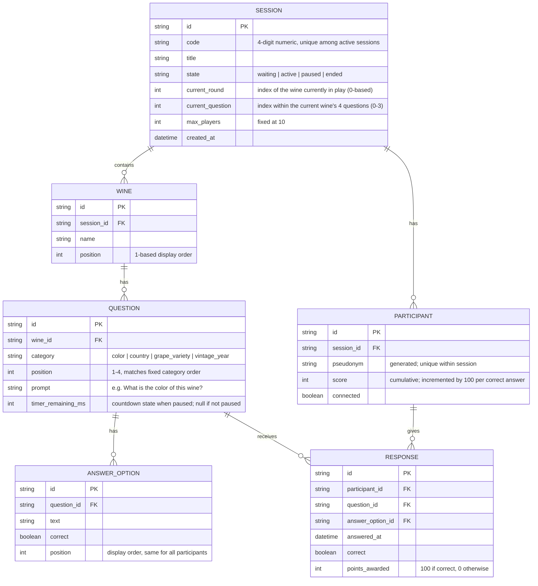

# Database / Persistence Model

This diagram documents the entities used if persistence is ever added. For the ephemeral MVP these exist only in-memory on the backend.

## Clarifications

- A **round** corresponds to one `WINE`. The `current_round` field on `SESSION` is the index of the wine currently being played.
- Each `WINE` always has exactly 4 `QUESTION` rows, one per fixed category: `color`, `country`, `grape_variety`, `vintage_year`.
- Each `QUESTION` always has exactly 4 `ANSWER_OPTION` rows (1 correct, 3 distractors). Options are stored and delivered in the order the host entered them — no per-player shuffling.
- `PARTICIPANT.score` is the running cumulative total (incremented by 100 per correct answer).
- `RESPONSE` is only created when a participant actually submits an answer. No response row = 0 points for that question (no penalty record is needed).
- `SESSION.code` is a 4-digit numeric string (e.g. `"4821"`), randomly generated and unique among active sessions at creation time.

## ER Diagram

